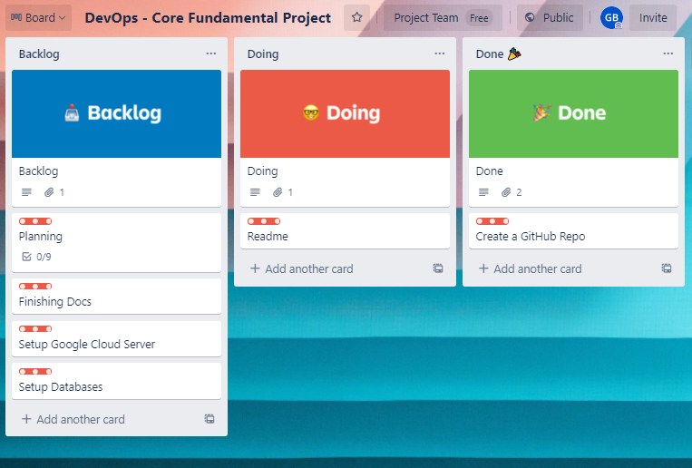

# QA-Devops-Core-Fundamental-Project

## Introduction 
***
QA tasked me with creating a project "DevOps - Core Fundamental Project"
 

## What The Program Does
***
 

## Requirments
***
 

## Project Managment
***
To manage this project I'm using Trello. If you would like to keep 
up to date with developments be sure to checkout it out!
[Trello Page](https://trello.com/b/CBkqPyBg/devops-core-fundamental-project)

 

## Architecture
***
 

## Software/Tools Used
***
- [Python3](https://www.python.org/)
- [Trello](https://trello.com)
 

## Testing
***
 

## Authors
*** 
- Gregory Beeson, [GitLab](https://gitlab.com/GregoryBeeson), [GitHub](https://github.com/GregoryBeeson)
 

## Refrences
***