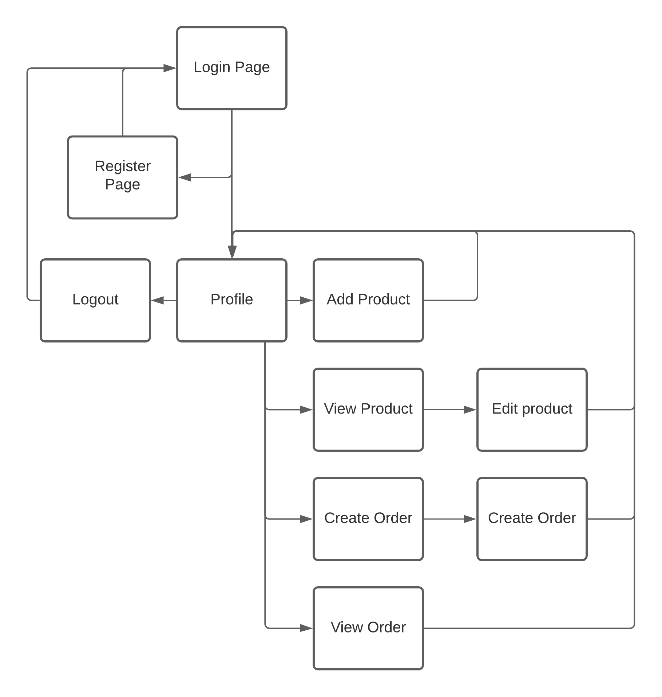
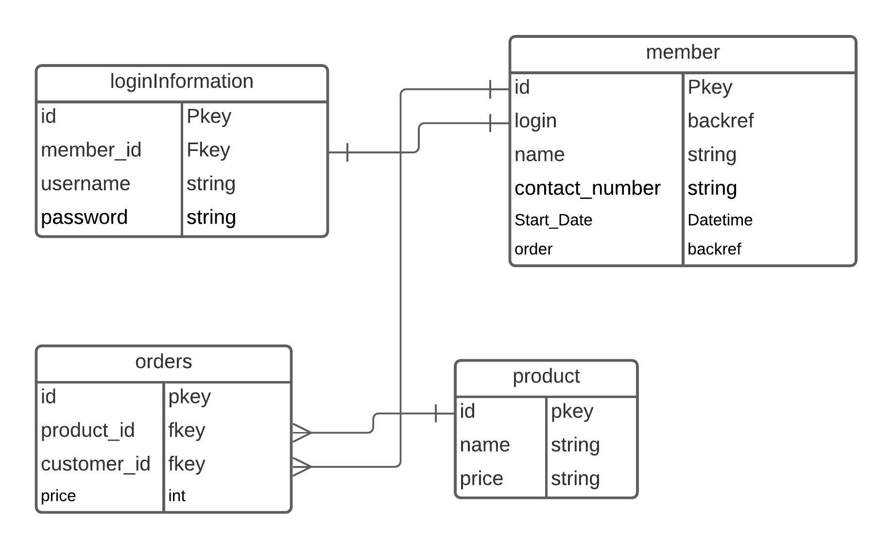
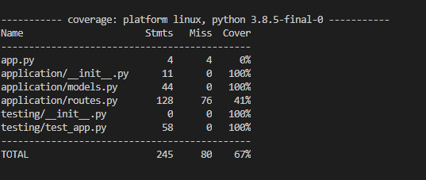

# QA-Devops-Core-Fundamental-Project

## Introduction 
***
QA tasked me with creating a project "DevOps - Core Fundamental Project"

In order to achive the goals set out for me by QA I have decided to make a simple
CRUD application with a login system. This program allows a user to add products,
edit the products, register users and make orders. 
 

## Requirements
***
All of the program requirments are also in the [Requirements Text File](Requirements.txt)
<ul>
<li>Flask</li>
<li>Flask-SQLAlchemy</li>
<li>SQLAlchemy</li>
<li>flask-bcrypt</li>
<li>pytest</li>
<li>pytest-cov</li>
<li>flask-testing</li>
<li>Jinja2</li>
<li>flask_wtf</li>
</ul>
 

## Project Managment
***
To manage this project I'm using Trello. If you would like to keep 
up to date with developments be sure to checkout it out!
[Trello Page](https://trello.com/b/CBkqPyBg/devops-core-fundamental-project)

 

## Architecture
***
Website Architecture
 
 
Database Architecture 

## Software/Tools Used

***
- [Python3](https://www.python.org/)
- [Trello](https://trello.com)
- [Vscode](https://code.visualstudio.com/)
- [GCP](https://cloud.google.com/)
 

## Testing
***

 

## Author
*** 
- Gregory Beeson, [GitLab](https://gitlab.com/GregoryBeeson), [GitHub](https://github.com/GregoryBeeson)
 

## Refrences
***
- George Wood, Bcrypt, [Website](https://uni.gwood.dev/blog/2021/01/bcrypt-login-system/)
- Pythonspot, session variables, [Website](https://pythonspot.com/login-authentication-with-flask/)